# 🎙️ AI Voice Assistant with Biometric Security

<div align="center">
  
  
  
  
  
  
  
  **A sophisticated AI-powered voice assistant that combines natural language processing, biometric authentication, and multi-service integration to create your personal digital companion.**
  
  ---
  
</div>

## ✨ Key Highlights

<table>
<tr>
<td width="50%">

**🛡️ Enterprise-Grade Security**
- Biometric face recognition
- Wake word activation ("Hey Bro")
- Real-time authentication
- Secure session management

</td>
<td width="50%">

**🧠 Advanced AI Integration**
- Natural language understanding
- Context-aware responses  
- Multi-service orchestration
- Intelligent command routing

</td>
</tr>
</table>

---

## 🎯 Core Features

### 🔐 **Biometric Security Layer**
> Advanced computer vision authentication system

- **Face Recognition**: OpenCV-powered biometric verification
- **Wake Word Detection**: Porcupine-based "Hey Bro" activation
- **Session Security**: Timeout protection and access control
- **Real-time Verification**: Continuous authentication monitoring

### 🧠 **AI Command Intelligence**
> Natural language processing with Google Gemini 2.0

- **Conversational Interface**: Speak naturally and be understood
- **Context Awareness**: Remembers conversation flow
- **Intent Recognition**: Advanced command interpretation
- **Response Generation**: Human-like AI interactions

### 📱 **Communication Hub**
> Seamless multi-platform messaging

| Feature | Description | Integration |
|---------|-------------|-------------|
| **WhatsApp** | Voice-to-message family contacts | PyWhatKit API |
| **Email** | AI-enhanced email composition | Gmail SMTP |

### 🌐 **Information Services**
> Real-time data access and processing

```
┌─────────────────┐    ┌─────────────────┐    ┌─────────────────┐
│   Weather API   │    │    News Feed    │    │  Web Search     │
│   Real-time     │    │   Headlines     │    │  AI-Powered     │
│   Conditions    │    │   Reliable      │    │  Q&A System     │
└─────────────────┘    └─────────────────┘    └─────────────────┘
```

### 🎵 **Entertainment & Media**
> Voice-controlled entertainment system

- **🎵 Music Streaming**: YouTube integration with voice control
- **🎬 Movie Recommendations**: AI-curated content suggestions  
- **📸 Photo Capture**: Voice-activated camera functionality
- **🌐 Web Navigation**: Hands-free browsing experience


## 🚀 Installation Guide

### 📋 Prerequisites

<details>
<summary><strong>System Requirements</strong></summary>

- **OS**: macOS 10.15+ (Catalina or later)
- **Python**: 3.9 or higher
- **Hardware**: 
  - Webcam (720p minimum)
  - Microphone (built-in or external)
  - 4GB RAM minimum
- **Network**: Stable internet connection

</details>

### ⚡ Quick Setup

#### Step 1: Repository Setup
```bash
# Clone the repository
git clone https://github.com/AdarshXNepal/ChandreTheAssistant.git
cd ChandreTheAssistant

```

#### Step 2: Dependencies
```bash
# Install all required packages
pip install -r requirements.txt

```

#### Step 3: Configuration Files

<details>
<summary><strong>Required Files Checklist</strong></summary>

- [ ] `photo.jpg` - Your reference photo for face recognition
- [ ] `Hey-Bro_en_mac_v3_0_0.ppn` - Porcupine wake word model
- [ ] `porcupine_params.pv` - Porcupine parameters file
- [ ] `.env` file with API keys (see configuration section)

</details>

---

## ⚙️ Configuration

### 🔑 API Keys Setup

Create a `.env` file in the project root:

```env
# Gemini AI Configuration
GEMINI_API_KEY=your_gemini_api_key_here

# Email Configuration
SENDER_EMAIL_ADDRESS=your-email@gmail.com
EMAIL_APP_PASSWORD=your-gmail-app-password
RECEIVER_EMAIL_ADDRESS=recipient@gmail.com

# WhatsApp Contact Configuration
BABA=+1234567890
MOM=+1234567891
SISTER=+1234567892

# News API
NEWS_API_KEY=your_newsapi_key_here

# Porcupine Wake Word
PV_ACCESS_KEY=your_porcupine_access_key_here
```

### 📧 Email Setup Guide

<details>
<summary><strong>Gmail Configuration Steps</strong></summary>

1. **Enable 2-Factor Authentication**
   - Go to Google Account settings
   - Security → 2-Step Verification → Turn On

2. **Generate App Password**
   - Security → App passwords
   - Select app: Mail
   - Select device: Other (Custom name)
   - Copy the 16-character password

3. **Update Configuration**
   ```python
   SENDER_EMAIL_ADDRESS = "your-email@gmail.com"
   EMAIL_APP_PASSWORD = "abcd efgh ijkl mnop"  # 16-character app password
   ```

</details>

### 🌍 Location Setup

Update weather coordinates in `get_weather()`:
```python
weather_params = {
    "latitude": 27.7005,   # Replace with your latitude
    "longitude": 83.4484,  # Replace with your longitude
    "current": ["temperature_2m", "weather_code", "wind_speed_10m"]
}
```

---

## 🎮 Usage & Commands

### 🎤 Voice Commands Reference

<table>
<tr>
<th>Category</th>
<th>Example Commands</th>
<th>Description</th>
</tr>
<tr>
<td><strong>🔐 Authentication</strong></td>
<td>"Hey Bro" + face recognition</td>
<td>Activate and authenticate</td>
</tr>
<tr>
<td><strong>📱 Communication</strong></td>
<td>"Send WhatsApp to Mom"<br>"Send an email"</td>
<td>Voice-to-message conversion</td>
</tr>
<tr>
<td><strong>🌦️ Information</strong></td>
<td>"What's the weather?"<br>"Get me the news"</td>
<td>Real-time data retrieval</td>
</tr>
<tr>
<td><strong>🎵 Entertainment</strong></td>
<td>"Play some music"<br>"Recommend a movie"</td>
<td>Media control and suggestions</td>
</tr>
<tr>
<td><strong>💻 System</strong></td>
<td>"Check system status"<br>"What time is it?"</td>
<td>Device monitoring</td>
</tr>
<tr>
<td><strong>📝 Memory</strong></td>
<td>"Remember this task"<br>"What's on my todo?"</td>
<td>Personal task management</td>
</tr>
<tr>
<td><strong>🌐 Web</strong></td>
<td>"Open YouTube"<br>"Search for..."</td>
<td>Web navigation and search</td>
</tr>
</table>

### 🎬 Demo Workflow

```
1. 👤 "Hey Bro" (Wake word activation)
2. 📷 Face recognition verification
3. 🎤 Voice command input
4. 🧠 AI processing and interpretation  
5. ⚡ Action execution
6. 🔊 Audio feedback response
```

---

## 🏗️ System Architecture

```mermaid
graph TD
    A[🎤 Voice Input] --> B[🎯 Wake Word Detection]
    B --> C[📷 Face Recognition]
    C --> D[📝 Speech-to-Text]
    D --> E[🧠 AI Command Processing]
    E --> F[⚡ Action Router]
    
    F --> G[📱 Communication Services]
    F --> H[🌐 Information Services]  
    F --> I[🎵 Entertainment Services]
    F --> J[💻 System Services]
    
    G --> K[🔊 Text-to-Speech Output]
    H --> K
    I --> K
    J --> K
```



### 🔧 Core Components

| Component | Technology | Purpose |
|-----------|------------|---------|
| **Voice Processing** | SpeechRecognition + pyttsx3 | Audio I/O handling |
| **Computer Vision** | OpenCV + face_recognition | Biometric authentication |
| **AI Engine** | Google Gemini 2.0 | Natural language understanding |
| **Wake Word** | Porcupine | Activation trigger |
| **Communication** | PyWhatKit + SMTP | Messaging integration |

---

## 📦 Dependencies

<details>
<summary><strong>Complete Requirements List</strong></summary>

```txt
speech-recognition==3.10.0      # Voice input processing
pyttsx3==2.90                   # Text-to-speech output
opencv-python==4.8.0            # Computer vision
face-recognition==1.3.0         # Biometric authentication
google-generativeai==0.3.0      # AI language model
gTTS==2.3.2                     # Google Text-to-Speech
pywhatkit==5.4                  # WhatsApp integration
psutil==5.9.5                   # System monitoring
requests==2.31.0                # HTTP requests
googletrans==4.0.0              # Translation services
openmeteo-requests==1.1.0       # Weather data
requests-cache==1.1.0           # Request caching
retry-requests==2.0.0           # Request retry logic
pvporcupine==3.0.0              # Wake word detection
```

</details>

---

## 🛠️ Customization & Extension

### 🎯 Adding Custom Commands

<details>
<summary><strong>Step-by-step Guide</strong></summary>

1. **Define the function**:
```python
def my_custom_action():
    """Your custom functionality here"""
    try:
        # Implementation
        speak("Custom action completed!")
    except Exception as e:
        speak("Error executing custom action")
```

2. **Update the command router**:
```python
# In perform_action() function
elif "my custom command" in action.lower():
    my_custom_action()
```

3. **Update AI prompt**:
```python
# Add to the Gemini prompt
"- For custom functionality, respond with 'my custom command'"
```

</details>

---

## 🐛 Troubleshooting

### ❌ Common Issues & Solutions

<details>
<summary><strong>🎤 Audio Issues</strong></summary>

**Problem**: Microphone not detected
- Check System Preferences → Security & Privacy → Microphone
- Grant permission to Terminal/Python
- Test with `python -c "import speech_recognition as sr; print(sr.Microphone.list_microphone_names())"`

**Problem**: Poor voice recognition
- Reduce background noise
- Speak clearly at moderate pace
- Check microphone input levels in System Preferences

</details>

<details>
<summary><strong>📷 Camera Issues</strong></summary>

**Problem**: Face recognition failing
- Ensure good lighting conditions
- Update reference photo (`photo.jpg`)
- Check camera permissions in System Preferences

</details>

<details>
<summary><strong>🔑 API Issues</strong></summary>

**Problem**: API authentication errors
- Verify API keys are correct and active
- Check API quotas and rate limits
- Ensure internet connectivity
- Test individual API endpoints

</details>


## 🤝 Contributing

### 🎯 How to Contribute

1. **Fork the repository**
   ```bash
   git fork https://github.com/AdarshXNepal/ChandreTheAssistant.git
   ```

2. **Create feature branch**
   ```bash
   git checkout -b feature/amazing-new-feature
   ```

3. **Make your changes**
   - Follow existing code style
   - Add appropriate comments
   - Test thoroughly

4. **Commit and push**
   ```bash
   git commit -m "✨ Add amazing new feature"
   git push origin feature/amazing-new-feature
   ```

5. **Create Pull Request**
   - Describe your changes clearly
   - Include screenshots/demos if applicable
   - Reference any related issues

### 🎨 Development Guidelines

- **Code Style**: Follow PEP 8 conventions
- **Documentation**: Update README for new features
- **Testing**: Ensure all functionality works
- **Error Handling**: Include proper exception handling

---

## 📄 License

```
MIT License

Copyright (c) 2024 ChandreTheAssistant

Permission is hereby granted, free of charge, to any person obtaining a copy
of this software and associated documentation files (the "Software"), to deal
in the Software without restriction, including without limitation the rights
to use, copy, modify, merge, publish, distribute, sublicense, and/or sell
copies of the Software, and to permit persons to whom the Software is
furnished to do so, subject to the following conditions:

The above copyright notice and this permission notice shall be included in all
copies or substantial portions of the Software.
```

---

## 🙏 Acknowledgments

<div align="center">

**Special Thanks To:**

| Technology | Provider | Purpose |
|------------|----------|---------|
| 🧠 **Gemini AI** | Google | Natural language processing |
| 👁️ **OpenCV** | Open Source | Computer vision framework |
| 🎤 **SpeechRecognition** | Community | Voice input processing |
| 🌦️ **Open-Meteo** | Open Source | Weather data API |
| 📰 **NewsAPI** | NewsAPI.org | News headlines service |
| 🔊 **Porcupine** | Picovoice | Wake word detection |

</div>

---

## 📞 Support & Community

<div align="center">

### 💬 Get Help

[](https://github.com/AdarshXNepal/ChandreTheAssistant/issues)
[](https://github.com/AdarshXNepal/ChandreTheAssistant/wiki)
[](https://github.com/AdarshXNepal/ChandreTheAssistant/discussions)

### 🌟 Show Your Support

If this project helped you, please consider:
- ⭐ **Starring** the repository
- 🐛 **Reporting** any bugs you find  
- 💡 **Suggesting** new features
- 📢 **Sharing** with friends and colleagues

</div>

---

<div align="center">
  
  **🎙️ Built with ❤️ from Adarsh for voice-activated convenience**
  
  *Transform your computer into an intelligent companion*
  
  
  
</div>
